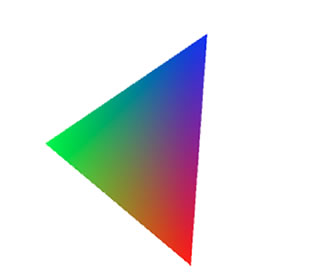
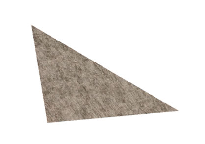

# Hello Triangle

In this article you'll examine a working OpenFL application based on the Stage3D
API. First you'll to learn how to properly configure a Stage3D-ready build
environment. Once the sample project is set up, you'll see how to initialize
Stage3D from Haxe, and how to create and render a super simple 3D scene
consisting of a single colored triangle using Stage3D.

Finally, you'll take a look at the process of applying texture mapping and
you'll review a Stage3D application with a texture mapped geometry.

### Setting up the build environment

When you get started building Stage3D apps, the first task involves preparing
your build environment and ensuring it is properly setup.

While it's certainly possible to build Stage3D applications using the barebones
Haxe compiler from the command line, it is often more convenient to use an
integrated tool such as Visual Studio Code or IntelliJ IDEA. The steps provided
in this article focus on working with Visual Studio Code.

If you haven't already, install Haxe and OpenFL. Begin by downloading and
installing the latest version of [Haxe](https://haxe.org/download/) from the
official website, or from your favorite package manager.

Next, open a terminal and run the following commands to install OpenFL from
Haxelib:

```sh
haxelib install openfl
haxelib run openfl setup
```

Now that you've set up the Haxe and OpenFL, you are ready to create a new OpenFL
project in Visual Studio Code.

If you've haven't yet installed the
[Lime extension for VSCode](https://marketplace.visualstudio.com/items?itemName=openfl.lime-vscode-extension),
it's pretty simple.

1. In Visual Studio Code, select **View** \> **Extensions**.

2. Search for the **Lime** extension by **OpenFL**.

3. Click the **Install** button.

With your development environment all set up, it's time to create a new project.

You will create an empty folder and run a command to create a project in that
folder.

1. In Visual Studio Code, select **File** \> **Open Folder…**

2. Create an empty folder for your project somewhere on your computer. Call it
   **HelloTriangle**.

3. Select the empty **HelloTriangle** folder and click Open.

4. Select **View** \> **Command Palette…**.

5. Search for and execute the **OpenFL: Create New Project** command.

6. When prompted to select a folder where the project should be created, select
   the empty **HelloTriangle** folder.

To make sure that everything compiles and runs properly, run Lime's test
command.

1. Select **Run** \> **Start Debugging**.

2. From the list of available debuggers, select **Lime**.

3. A **launch.json** file will open with the following launch configuration:

   ```
   {
       "name": "Lime",
       "type": "lime",
       "request": "launch"
   }
   ```

4. Select **Run** \> **Start Debugging** again.

The project will build, and your web browser will launch a blank window.

> Alternatively, you may compile and run the project from a terminal. Open a
> terminal, navigate to the HelloTriangle folder, and run the following command:
>
> ```sh
> lime test html5 -debug
> ```

Next, we'll add some Haxe code to actually display something in the browser
using Stage3D.

### Initializing Stage3D

Now that you've set up the OpenFL app, the first thing you'll do is initialize
Stage3D.

In order to perform 3D rendering, you'll need an instance of the Context3D
class, which is basically going to serve as a 3D rendering surface.

So, in the constructor, add the following code:

```haxe
public function new()
{
    super();
    stage.stage3Ds[0].addEventListener(Event.CONTEXT3D_CREATE, initStage3D);
    stage.stage3Ds[0].requestContext3D();
}
```

The code above simply requests a Context3D instance using the Stage3D API, and
registers an event listener. When the Context3D instance is ready, the
`initStage3D` function is called back by the event.

As soon as `initStage3D` is called, it's important to properly configure your
Context3D instance by calling the `configureBackBuffer` method:

```haxe
private function initStage3D(e:Event):Void
{
    context3D = stage.stage3Ds[0].context3D;
    context3D.configureBackBuffer(800, 600, 2, true);
    ...
}
```

The code above specifies that you are using an 800 x 600 pixel rendering
viewport, with a minimal level of anti-aliasing (the third parameter), and
creating depth and stencil buffers for this rendering surface (the fourth
parameter).

### Creating a colored triangle geometry

In this section you'll create some 3D geometry (the 3D object to be rendered).
For this sample, you'll create the simplest geometry possible: a colored
triangle.

To accomplish this, you'll need a Vertex Buffer, and you are going to specify
Vertex Attributes for vertex position (x, y, z) and vertex color (r, g, b). Each
vertex has 6 components. Begin by defining this Vertex Buffer data into a
vector, like this:

```haxe
private function initStage3D(e:Event):Void
{
    ...
    var vertices:Vector<Float> = Vector.ofValues(
        -0.3,-0.3, 0.0, 1.0, 0.0, 0.0, // x, y, z, r, g, b
        -0.3, 0.3, 0.0, 0.0, 1.0, 0.0,
         0.3, 0.3, 0.0, 0.0, 0.0, 1.0);
    ...
}
```

Then, create a VertexBuffer3D instance that you can use to upload the Vertex
Buffer data to the GPU.

```haxe
private var vertexBuffer:VertexBuffer3D;
...
private function initStage3D(e:Event):Void
{
    ...
    // Create VertexBuffer3D. 3 vertices, of 6 Floats each
    vertexBuffer:VertexBuffer3D = context3D.createVertexBuffer(3, 6);
    // Upload VertexBuffer3D to GPU. Offset 0, 3 vertices
    vertexBuffer.uploadFromVector(vertices, 0, 3);
    ...
}
```

You'll also need an Index Buffer to define your triangle. In this case, the lone
triangle will simply consist of vertices 0, 1 and 2. Similar to the Vertex
Buffer, the Index Buffer must also be uploaded to the GPU. To achieve this
you'll use the IndexBuffer3D class:

```haxe
private var indexBuffer:IndexBuffer3D;
...
private function initStage3D(e:Event):Void
{
    ...
    var indices:Vector<UInt> = Vector.ofValues(0, 1, 2);
    // Create IndexBuffer3D. Total of 3 indices. 1 triangle of 3 vertices
    indexBuffer = context3D.createIndexBuffer(3);
    // Upload IndexBuffer3D to GPU. Offset 0, count 3
    indexBuffer.uploadFromVector(indices, 0, 3);
    ...
}
```

The code above defines the geometry. Now you need both a Vertex and a Fragment
Shader.

To keep it simple, you'll use the same shader program discussed in a previous
article in this series titled [What is AGAL?](./what-is-agal.md). The Vertex
Shader simply transforms the vertices according to a transform matrix passed in
from Haxe, and then passes along the vertex color down the rendering pipeline to
the Fragment Shader.

    m44 op, va0, vc0
    mov v0, va1

The Fragment Shader gets the interpolated color from its input and passes it
along as output color.

    mov oc, v0

You'll use
[AGAL Mini Assembler](https://github.com/Gamua/Starling-Framework/blob/master/starling/src/com/adobe/utils/AGALMiniAssembler.as)
to assemble the shader code into object code, and then use the Program3D API
class to upload the shader to the GPU.

```haxe
private function initStage3D(e:Event):Void
{
    ...
    var vertexShaderAssembler:AGALMiniAssembler = new AGALMiniAssembler();
    vertexShaderAssembler.assemble(Context3DProgramType.VERTEX,
        "m44 op, va0, vc0\n" + // pos to clipspace
        "mov v0, va1" // copy color
    );

    var fragmentShaderAssembler:AGALMiniAssembler = new AGALMiniAssembler();
    fragmentShaderAssembler.assemble(Context3DProgramType.FRAGMENT,

        "mov oc, v0 "
    );

    program = context3D.createProgram();
    program.upload(vertexShaderAssembler.agalcode, fragmentShaderAssembler.agalcode);
    ...
}
```

### Rendering the scene

At this point, the scene is now ready for rendering. In this section, you'll set
up a rendering loop. Just create an `onRender` function that is called at every
frame by an `ENTER_FRAME` event.

```haxe
private function onRender(e:Event):Void
{
    if (context3D == null)
        return;
    ...
}
```

At the start of each frame render, you'll call `clear()` on the `Context3D`
instance. This clears the rendering color buffer (the surface on which the
content is rendered) with a background color that we pass in (as the depth and
stencil buffers associated with the Context3D get cleared). Use the code shown
below to pass in a white background:

```haxe
private function onRender(e:Event):Void
{
    ...
    context3D.clear(1, 1, 1, 1);
    ...
}
```

At each frame you'll have to enable the Program3D with the uploaded Shaders, as
well as the VertexBuffer3D, associating the Vertex Attributes with the proper
Shader Attribute Registers, as discussed in the previous article
[What is AGAL](./what-is-agal.md).

You'll also need to pass in the transform matrix, used by the Vertex Shader.
Let's use a rotation matrix that varies at each frame, to let our triangle spin
a little bit…

```haxe
private function onRender(e:Event):Void
{
    ...
    // vertex position to attribute register 0
    context3D.setVertexBufferAt(0, vertexBuffer, 0, Context3DVertexBufferFormat.FLOAT_3);
    // color to attribute register 1
    context3D.setVertexBufferAt(1, vertexBuffer, 3, Context3DVertexBufferFormat.FLOAT_3);
    // assign shader program
    context3D.setProgram(program);

    var m:Matrix3D = new Matrix3D();
    m.appendRotation(Lib.getTimer() / 40.0, Vector3D.Z_AXIS);
    context3D.setProgramConstantsFromMatrix(Context3DProgramType.VERTEX, 0, m, true);
    ...
}
```

After setting this up, it's time to perform the actual rendering. You'll need to
call the `drawTriangles` method on the `Context3D` instance, passing in the
Index Buffer; this operation will render the triangle to the rendering surface
(the color buffer).

Finally, after you are finished rendering all the 3D objects of the scene in
that frame (in this example, there is only one), you'll need to call the
`present` method on the `Context3D` instance. This method tells Stage3D that the
app has rendered the frame and the frame is ready to be presented to the screen.

```haxe
private function onRender(e:Event):Void
{
    ...
    context3D.drawTriangles(indexBuffer);

    context3D.present();
}
```

Run the Hello Triangle Colored application to see the finished result and take a
moment to enjoy your creation (see Figure 2).



_Figure 1. The completed Hello Triangle Colored application._

Here is the entire code sample used to create the Hello Triangle Colored
application:

```haxe
import openfl.Lib;
import openfl.Vector;
import openfl.display.Sprite;
import openfl.display3D.Context3D;
import openfl.display3D.Context3DProgramType;
import openfl.display3D.Context3DVertexBufferFormat;
import openfl.display3D.IndexBuffer3D;
import openfl.display3D.Program3D;
import openfl.display3D.VertexBuffer3D;
import openfl.events.Event;
import openfl.geom.Matrix3D;
import openfl.geom.Vector3D;
import openfl.utils.AGALMiniAssembler;

class HelloTriangleColored extends Sprite
{
    private var context3D:Context3D;
    private var program:Program3D;
    private var vertexBuffer:VertexBuffer3D;
    private var indexBuffer:IndexBuffer3D;

    public function new()
    {
        super();

        stage.stage3Ds[0].addEventListener(Event.CONTEXT3D_CREATE, initStage3D);
        stage.stage3Ds[0].requestContext3D();

        addEventListener(Event.ENTER_FRAME, onRender);

    }

    private function initStage3D(e:Event):Void
    {
        context3D = stage.stage3Ds[0].context3D;
        context3D.configureBackBuffer(800, 600, 1, true);

        var vertices:Vector<Float> = Vector.ofValues(
            -0.3,-0.3, 0.0, 1.0, 0.0, 0.0, // x, y, z, r, g, b
            -0.3, 0.3, 0.0, 0.0, 1.0, 0.0,
             0.3, 0.3, 0.0, 0.0, 0.0, 1.0);

        // Create VertexBuffer3D. 3 vertices, of 6 Floats each
        vertexBuffer = context3D.createVertexBuffer(3, 6);
        // Upload VertexBuffer3D to GPU. Offset 0, 3 vertices
        vertexBuffer.uploadFromVector(vertices, 0, 3);

        var indices:Vector<UInt> = Vector.ofValues(0, 1, 2);

        // Create IndexBuffer3D. Total of 3 indices. 1 triangle of 3 vertices
        indexBuffer = context3D.createIndexBuffer(3);
        // Upload IndexBuffer3D to GPU. Offset 0, count 3
        indexBuffer.uploadFromVector(indices, 0, 3);

        var vertexShaderAssembler:AGALMiniAssembler = new AGALMiniAssembler();
        vertexShaderAssembler.assemble(Context3DProgramType.VERTEX,
            "m44 op, va0, vc0\n" + // pos to clipspace
            "mov v0, va1" // copy color
        );

        var fragmentShaderAssembler:AGALMiniAssembler = new AGALMiniAssembler();
        fragmentShaderAssembler.assemble(Context3DProgramType.FRAGMENT,

            "mov oc, v0"
        );

        program = context3D.createProgram();
        program.upload(vertexShaderAssembler.agalcode, fragmentShaderAssembler.agalcode);
    }

    private function onRender(e:Event):Void
    {
        if (context3D == null)
            return;

        context3D.clear(1, 1, 1, 1);

        // vertex position to attribute register 0
        context3D.setVertexBufferAt(0, vertexBuffer, 0, Context3DVertexBufferFormat.FLOAT_3);
        // color to attribute register 1
        context3D.setVertexBufferAt(1, vertexBuffer, 3, Context3DVertexBufferFormat.FLOAT_3);
        // assign shader program
        context3D.setProgram(program);

        var m:Matrix3D = new Matrix3D();
        m.appendRotation(Lib.getTimer() / 40.0, Vector3D.Z_AXIS);
        context3D.setProgramConstantsFromMatrix(Context3DProgramType.VERTEX, 0, m, true);

        context3D.drawTriangles(indexBuffer);

        context3D.present();
    }
}
```

### Applying texture mapping

The Hello Triangle Colored application that you built in the previous part of
this article renders a colored triangle. The triangle's colors are specified as
Vertex Attributes, which are part of the Vertex Buffer. The triangle is an
example of colored geometry and the colors are specified per-vertex.

In this section you'll explore a different way to render a geometry, using a
common technique called texture mapping. Texture mapping is the process of using
an image (a texture) to apply it to the geometry. You can think of this texture
image as though it is an illustrated piece of paper, sort of like a piece of
wallpaper. Specify a triangle (or, more generally, a 3D object), and wrap this
illustrated paper around the surface of the object.

Using this strategy, you can render a 3D object **as if** it really contains all
those tiny details from the illustrated texture. In reality, the texture details
are not actually part of the geometry. The visual complexity is simply
illustrated details from the applied texture image.

When you apply texture mapping you'll specify the exact positions the texture
elements need to be placed on top of the geometry. Basically, when you wrap the
geometry around with the texture image, you need to create a precise mapping
that defines exactly where each pixel of the texture image should fall on the 3D
geometry.

#### Working with UV coordinates

The way to line up a texture on the 3D geometry involves specifying the mapping
on a per-vertex basis: for each vertex you specify a pair of 2D coordinates,
indicated as (U, V), that define the point of the texture image that corresponds
to that specific vertex. So, these UV coordinates are specified as Vertex
Attributes in the Vertex Buffer and the Vertex Shader receives them as an input
stream.

Then, as it normally happens with Vertex Attributes, the Vertex Shader passes
the UV coordinates out as outputs down the rendering pipeline, and the
Rasterizer interpolates them (for more details, see a previous article in this
series titled [Vertex and Fragment Shaders](./vertex-and-fragment-shaders.md)).
In this way, the Fragment Shader receives the proper values of the UV
coordinates for each triangle Fragment (for each pixel that will be rendered).
So, each pixel of each rendered triangle gets mapped to a specific pixel of the
texture (also known as a texture element, or texel).

In other words, by specifying the UV coordinates, you've created a mapping
between the 3D geometry and the texture image. The is the concept behind the
term texture mapping.

### Working with the Texture class in the Stage3D API

The Texture class in the Stage3D API includes support for applying textures.

A texture image must first be uploaded to the GPU memory in order to be used
during rendering. You can use the Texture class to upload a texture image to the
GPU, using the following code:

```haxe
private var texture:Texture;
...

private function initStage3D(e:Event):Void
{
    ...
    var bitmapData:BitmapData = Assets.getBitmapData("assets/img/RockSmooth.jpg");
    texture = context3D.createTexture(bitmapData.width, bitmapData.height, Context3DTextureFormat.BGRA, false);
    texture.uploadFromBitmapData(bitmapData);
    ...
}
```

As discussed above, the Vertex Shader receives the UV texture coordinates as a
Vertex Attribute, and passes them as output down the rendering pipeline so that
they can be properly interpolated and fed to the Fragment Shader. The Vertex
Shader is very similar to the the colored triangle sample project described
above, except that Attribute Register 1 contains UV coordinates instead of color
values.

    m44 op, va0, vc0
    mov v0, va1

The Fragment Shader receives the interpolated UV coordinates and uses them to
sample the texture, through a Texture Sampler.

Let's imagine that the texture is associated to Haxe to Texture Sampler 0. In
this case, the Fragment Shader will be:

    tex ft1, v0, fs0 <2d>
    mov oc, ft1

The first line of the Fragment Shader samples the texture using Texture Sampler
0 and the UV coordinates in varying register 0, and copies the result into
Temporary Register 1. The second line simply copies the content of Temporary
Register 1 (the sampled texture) to the output.

#### Modifying the Hello Triangle Colored application to apply a texture map

In this section you'll modify the previous Hello Triangle application, so that
it uses texture mapping.

The first thing to update in the application is to add an image for a texture.
In your OpenFL project.xml file, add an `<assets/>` element to load an external
texture image:

```xml
...
    <assets path="assets/img/RockSmooth.jpg"/>
</project>
```

You'll also need to change the definition of the Vertex Buffer. Rather than
passing the color Vertex Attribute, you'll provide UV coordinates:

```haxe
private function initStage3D(e:Event):Void
{
    ...
    var vertices:Vector<Float> = Vector.ofValues(
        -0.3,-0.3,0.0, 1.0, 0.0, // x, y, z, u, v
        -0.3, 0.3, 0.0, 0.0, 1.0,
         0.3, 0.3, 0.0, 1.0, 1.0);

    // Create VertexBuffer3D. 3 vertices, of 5 Floats each
    vertexBuffer = context3D.createVertexBuffer(3, 5);
    // Upload VertexBuffer3D to GPU. Offset 0, 3 vertices
    vertexBuffer.uploadFromVector(vertices, 0, 3);
    ...
}
```

Notice that UV coordinates are defined between 0 and 1, where (U, V) = (0, 0)
means the bottom-left corner of the texture image, and (U, V) = (1, 1) means the
top-right corner.

The rendering loop then enables the Texture object, and associates it to Texture
Sampler 0 that is used by the Fragment Shader:

    private function onRender(e:Event):Void
    {
        ...
        // assign texture to texture sampler 0
        context3D.setTextureAt(0, texture);
        ...
    }

After making these changes, run the application again to see the textured
triangle displayed in the Stage3D app you created (see Figure 3).



_Figure 2. The completed Hello Triangle Textured application._

Here's the entire code sample used to create the Hello Textured Triangle
application:

```haxe
import openfl.Lib;
import openfl.Vector;
import openfl.display.BitmapData;
import openfl.display.Sprite;
import openfl.display3D.Context3D;
import openfl.display3D.Context3DProgramType;
import openfl.display3D.Context3DTextureFormat;
import openfl.display3D.Context3DVertexBufferFormat;
import openfl.display3D.IndexBuffer3D;
import openfl.display3D.Program3D;
import openfl.display3D.VertexBuffer3D;
import openfl.display3D.textures.Texture;
import openfl.events.Event;
import openfl.geom.Matrix3D;
import openfl.geom.Vector3D;
import openfl.utils.AGALMiniAssembler;
import openfl.utils.Assets;

class HelloTriangleTextured extends Sprite
{
    private var texture:Texture;

    private var context3D:Context3D;
    private var program:Program3D;
    private var vertexBuffer:VertexBuffer3D;
    private var indexBuffer:IndexBuffer3D;

    public function new()
    {
        super();

        stage.stage3Ds[0].addEventListener(Event.CONTEXT3D_CREATE, initStage3D);
        stage.stage3Ds[0].requestContext3D();

        addEventListener(Event.ENTER_FRAME, onRender);
    }

    private function initStage3D(e:Event):Void
    {
        context3D = stage.stage3Ds[0].context3D;
        context3D.configureBackBuffer(800, 600, 1, true);

        var vertices:Vector<Float> = Vector.ofValues(
            -0.3,-0.3, 0.0, 1.0, 0.0, // x, y, z, u, v
            -0.3, 0.3, 0.0, 0.0, 1.0,
             0.3, 0.3, 0.0, 1.0, 1.0);

        // Create VertexBuffer3D. 3 vertices, of 5 Numbers each
        vertexBuffer = context3D.createVertexBuffer(3, 5);
        // Upload VertexBuffer3D to GPU. Offset 0, 3 vertices
        vertexBuffer.uploadFromVector(vertices, 0, 3);

        var indices:Vector<UInt> = Vector.ofValues(0, 1, 2);

        // Create IndexBuffer3D. Total of 3 indices. 1 triangle of 3 vertices
        indexBuffer = context3D.createIndexBuffer(3);
        // Upload IndexBuffer3D to GPU. Offset 0, count 3
        indexBuffer.uploadFromVector(indices, 0, 3);

        var bitmapData:BitmapData = Assets.getBitmapData("assets/img/RockSmooth.jpg");
        texture = context3D.createTexture(bitmapData.width, bitmapData.height, Context3DTextureFormat.BGRA, false);
        texture.uploadFromBitmapData(bitmapData);

        var vertexShaderAssembler:AGALMiniAssembler = new AGALMiniAssembler();
        vertexShaderAssembler.assemble(Context3DProgramType.VERTEX,
            "m44 op, va0, vc0\n" + // pos to clipspace
            "mov v0, va1" // copy UV
        );

        var fragmentShaderAssembler:AGALMiniAssembler = new AGALMiniAssembler();
        fragmentShaderAssembler.assemble(Context3DProgramType.FRAGMENT,
            "tex ft1, v0, fs0 <2d>\n" +
            "mov oc, ft1"
        );

        program = context3D.createProgram();
        program.upload(vertexShaderAssembler.agalcode, fragmentShaderAssembler.agalcode);
    }

    private function onRender(e:Event):Void
    {
        if (context3D == null)
            return;

        context3D.clear(1, 1, 1, 1);

        // vertex position to attribute register 0
        context3D.setVertexBufferAt(0, vertexBuffer, 0, Context3DVertexBufferFormat.FLOAT_3);
        // UV to attribute register 1
        context3D.setVertexBufferAt(1, vertexBuffer, 3, Context3DVertexBufferFormat.FLOAT_2);
        // assign texture to texture sampler 0
        context3D.setTextureAt(0, texture);
        // assign shader program
        context3D.setProgram(program);

        var m:Matrix3D = new Matrix3D();
        m.appendRotation(Lib.getTimer() / 40.0, Vector3D.Z_AXIS);
        context3D.setProgramConstantsFromMatrix(Context3DProgramType.VERTEX, 0, m, true);

        context3D.drawTriangles(indexBuffer);

        context3D.present();
    }
}
```

### Where to go from here

In this article you used the concepts learned in the previous articles in the
Stage3D series, to finally drill into the core processes and create two fully
working OpenFL applications based on Stage3D. Even though the sample
applications just created a simple scene, consisting of a single triangle, all
of the concepts of working with Stage3D are included. From here on as you
experiment with building Stage3D apps, things will only get deeper and more
interesting.

In the next article in the Stage3D series, you'll learn about a fundamental
topic for 3D rendering: working with perspective.

- [5. Working with Stage3D and perspective projection](./working-with-stage3d-and-perspective-projection.md)
- [6. Working with 3D cameras](./working-with-3d-cameras.md)
- [7. Mipmapping for smoother textures in Stage3D](./mipmapping-for-smoother-textures-in-stage3d.md)
