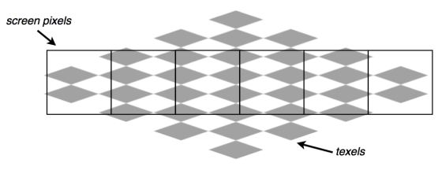
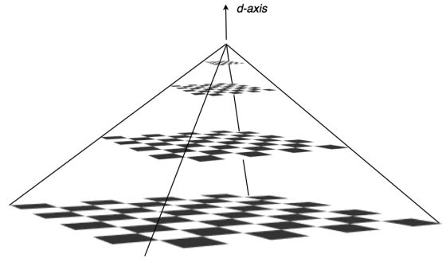

# Mipmapping for smoother textures in Stage3D

In this article I am going to introduce you to a big problem that often shows up
when rendering texture mapped geometries, called "texture sampling aliasing,"
that can cause artifacts in the rendered scene. I will cover the available
techniques for reducing the effects of this problem: bilinear filtering,
mipmapping, and trilinear filtering. The accompanying sample application will
also show you how to create a Stage3D-based application that uses these
techniques.

### The problem of aliasing with "distant" triangles

What is it with distant triangles?

In the previous articles of this series you saw how to
[render a textured triangle](./hello-triangle.md). Texture mapping simply means
to take a texture image and to wrap it around a 3D object that gets rendered.
You also saw how to
[render triangles in perspective](./working-with-stage3d-and-perspective-projection.md)
and how to roam around your 3D scene using a
[3D camera](./working-with-3d-cameras.md). This means that, as your camera
moves, a triangle may become either big on the screen, when the camera is close
to it, or very small on the screen, when the camera is far away from it.

This is all cool and dandy, and you get your neatly rendered geometry. But it is
not always as simple as it seems, as there may be a few issues to deal with.

Let me first try and explain the problem intuitively. The trouble comes when you
take a texture that is some size that is, say, "proper" for the screen—not too
big, not too small—and you apply it to some object that is rendered as very
small on the screen (for example, a faraway object in the 3D scene).

Let me put down some numbers, so that it gets clearer. Say you have a texture
that is 512×512 pixels and you apply this texture to a 3D triangle. Now, if this
rendered triangle ends up projected on the screen as something that's more or
less on the same scale as the texture—something around 512×512 pixels on the
screen—then it will all be okay, as the scaling of the texture is not going to
be too severe.

On the other hand, if this triangle is far away from the eye point, so it gets
rendered as a very small object on the screen—say, it fits within a 20×20 pixel
area on the screen—then the texture gets strongly scaled, and this can produce
some very bad artifacts on the final rendered object.

The problem is one of putting together the texture mapping with the process of
scaling. Figure 1 shows a rendered texture with the actual pixel screens
overlaid. You can see how several texels (pixels of the texture), fall inside a
single screen pixel.



_Figure 1. A checkerboard textured object viewed through a row of screen
pixels._

This creates the problem of having to come up with a rendered pixel color for
each screen pixel that somehow represents all the texels falling within that
pixel. This whole process of picking a texel and assigning it to a pixel is
called _texture sampling,_ and it's what the Texture Sampler registers in the
Fragment Shaders are made for.

The most straightforward way to do the texture sampling is to simply choose the
"nearest neighbor" texel: the one that, in the texture mapping, falls closest to
the screen pixel center. This method is simple, but it's also the one that
creates the worst artifacts. See Figure 2 for an example of artifacts caused by
nearest neighbor texture sampling.


_Figure 2. Artifacts from nearest-neighbour texture sampling._

Mind you, texture sampling artifacts are not always this bad when using
nearest-neighbor texture sampling. In general, they depend on the kind of
texture used and on the distance and orientation of the object from the 3D
camera. This is a particularly bad case. Checkered textures are often the worst
in terms of texture sampling artifacts.

This problem gets even worse when the object moves around on the screen. In
fact, when the on-screen position of the object changes, the sampling changes as
well, so you often see a strong flickering of the artifacts that makes them
extremely evident.

So, what do you do?

### What is mipmapping?

A simple way to reduce the effect of texture sampling artifacts is to use a
technique called _bilinear filtering._ Instead of just using the nearest
neighbor texel, a bilinear filter takes into account four nearby texels, and
blends them through linear interpolation.

This improves the situation just a little bit, as you can see in Figure 3.


_Figure 3. Texture sampling using bilinear filtering._

However, the most popular way to solve this problem is to use a technique called
_mipmapping._ The "mip" stands for "*m*ultum *i*n *p*arvo". This comes from
Latin, and it means "multiple things in a small place." In fact, mipmapping is a
process where the original texture gets filtered down repeatedly into a series
of smaller textures, thus creating a multitude of textures that get associated
to the same pixel.

#### How does it work?

Instead of using just the standard 512×512 texture, you also precalculate
reduced versions of the same texture: 256×256, 128×128, and so on, down to the
1×1 version. Thus, you create the so-called texture pyramid, as shown in
Figure 4.



_Figure 4. Mipmapping texture pyramid._

So, for a 512×512 texture, this means a total of nine textures get generated.
Each of the different textures is called a _mip level,_ and it's often indicated
with the letter _d_ (where _d_ goes from 0 to 8 in this case).

Now, this might seem a horrible waste of GPU memory: to use nine actual texture
images for every single texture of every object. But think of this: the mip
level textures are smaller than the main full-size texture. And if you calculate
the total space occupied by the full mipmapped texture (all the nine levels in
this example), you'll see that it is only 33% times bigger than the single full
size texture:

512×512 + 256×256 + 128×128 + ….1×1 \< 512×512 \* (1 + 1/3)

So, it's not that much of a waste of GPU memory as if you were using nine times
the memory. You're just using 1.33 times the memory.

#### What do you do with these mip levels?

When mip levels are available for a texture, and mipmapping is enabled, then,
for every triangle pixel that gets rendered, the rendering pipeline looks at how
large (or small) this pixel is when mapped onto the texture and compared to the
size of the texels, as shown in Figure 5. If the size of the projected pixel and
the texels are about the same, then the main texture can be used without too
many problems. On the other hand, if the triangle pixel is much bigger than the
texels—or, in other words, if many of the texels fall inside the triangle
pixel—then it means that a mip level corresponding to a reduced version of the
texture needs to be used.


_Figure 5. Projection of pixel cell onto texture space._

In reality, what happens is that a value for _d_ gets calculated starting from
some sort of ratio between the triangle pixel size (projected onto the texture
space) and the texel size. And this value of _d_ corresponds to the mip level
that is more suitable for being used.

In the simplest case, this calculated value of _d_ gets rounded to the nearest
integer, and the pixel from that mip level texture gets used for that specific
triangle pixel. This is called "nearest neighbor" mipmapping.

A more accurate way to do it is to not round off _d_ to the nearest mip level,
but to also take into account the "distance" from the two levels between which
_d_ sits, and then perform a linear interpolation of the two mip level textures
that bound _d_, using _d_ as a distance. This process of interpolation is called
_linearly filtered mipmapping._ It is more accurate and produces better results,
but it's also a bit heavier on the GPU.

An even more advanced way to use mipmapping is to combine linearly filtered
mipmapping with bilinear filtering and obtain even better results. This is
called _trilinear filtering._

### How to use mipmapping in Stage3D

How do you put this theory into practice, and use mipmapping with the Stage3D
API? Stage3D supports mipmapping by means of the Texture class. In fact,
whenever you upload a texture image to the GPU using the Texture class, you can
specify, as a parameter, the mip level to which the image corresponds.

Here's the code to create a mip level and upload it to the GPU:

```haxe
var bitmap:Bitmap = new TextureBitmap();
texture = context3D.createTexture(bitmap.bitmapData.width, bitmap.bitmapData.height, Context3DTextureFormat.BGRA, false);
texture.uploadFromBitmapData(bitmap.bitmapData, mipLevel);
```

The Fragment Shader that uses the texture will then need to specify that it
wants to use mipmapping when sampling the texture. This is done by using either
the `mipnearest` or the `miplinear` flags when using the Texture Sampler. As the
name implies, `mipnearest` uses nearest-neighbor mipmapping, while `miplinear`
uses linearly filtered mipmapping.

The following Fragment Shader performs linearly filtered mipmapping with
bilinear filtering disabled:

    // linearly filtered mip mapping. bilinear filtering disabled
    tex ft1, v0, fs0 <2d, nearest, miplinear>
    mov oc, ft1

Here is the version with nearest-neighbour mipmapping using the `mipnearest`
flag instead:

    // nearest-neighbor mip mapping. bilinear filtering disabled
    tex ft1, v0, fs0 <2d, nearest, mipnearest>
    mov oc, ft1

It is also possible to use trilinear filtering by specifying `linear` instead of
`nearest`:

    // trilinear filtering.
    tex ft1, v0, fs0 <2d, linear, mipnearest>
    mov oc, ft1

If, on the other hand, you don't want mipmapping and just want to go for simple
bilinear filtering, just use `mipnone` (or `nomip`; they're the same) in place
of `mipnearest` / `miplinear` and keep the `linear` flag on:

    // bilinear filtering
    tex ft1, v0, fs0 <2d, linear, mipnone>
    mov oc, ft1

### A sample mipmapping application

I'll now show you how to create an application that uses mipmapping.

Start from the code that was created in the previous article on
[3D cameras](./working-with-3d-cameras.md), as it's useful to be able to roam
around the scene and see the effects of mipmapping. But this time, you're going
to be using a checkered texture instead of a rocky texture, so that the
artifacts are more visible.

Instead of a rectangle spinning in the distance, you'll use a static horizontal
floor plane, above which you can roam around:

```haxe
var vertices:Vector<Float> = Vector.ofValues(
    -0.3, 0.0, 0.0, 0.0, 0.0, // x, y, z, u, v
     0.0, 0.0, 0.3, 0.0, 1.0,
     0.3, 0.0, 0.0, 1.0, 1.0,
     0.0, 0.0,-0.3, 1.0, 0.0);
...
cameraWorldTransform = new Matrix3D();
cameraWorldTransform.appendTranslation(0, 0.02, -0.3);
```

Now you need to generate the different mip levels. Start from the full-size
512×512 texture, and then calculate and upload scaled-down versions of it:

```haxe
public function uploadTextureWithMipMaps(tex:Texture, originalImage:BitmapData):Void
{
    var mipWidth:Int = originalImage.width;
    var mipHeight:Int = originalImage.height;
    var mipLevel:Int = 0;
    var mipImage:BitmapData = new BitmapData(originalImage.width, originalImage.height);
    var scaleTransform:Matrix = new Matrix();

    while (mipWidth > 0 && mipHeight > 0)
    {
        mipImage.draw(originalImage, scaleTransform, null, null, null, true);
        tex.uploadFromBitmapData(mipImage, mipLevel);
        scaleTransform.scale(0.5, 0.5);
        mipLevel++;
        mipWidth >>= 1;
        mipHeight >>= 1;
    }
    mipImage.dispose();
}
```

This is it! The application is done. Figure 6 shows the result, with trilinear
filtering enabled. Have fun roaming around the checkered floor using your
keyboard arrows. I encourage you to change the flags in the Fragment Shader and
test the various texture filtering settings discussed earlier:

1.  Nearest-neighbor texture sampling without mipmapping
2.  Bilinear filtering without mipmapping
3.  Nearest-neighbor mipmapping with and without bilinear filtering
4.  Linearly interpolated mipmapping without bilinear filtering.

Notice the visual differences in the result.


_Figure 6. Application in action with Trilinear Filtering enabled._

Here is the entire code used for the 3D camera application:

```haxe
import openfl.Assets;
import openfl.Vector;
import openfl.display.BitmapData;
import openfl.display.Sprite;
import openfl.display.StageAlign;
import openfl.display.StageScaleMode;
import openfl.display3D.Context3D;
import openfl.display3D.Context3DProgramType;
import openfl.display3D.Context3DTextureFormat;
import openfl.display3D.Context3DVertexBufferFormat;
import openfl.display3D.IndexBuffer3D;
import openfl.display3D.Program3D;
import openfl.display3D.VertexBuffer3D;
import openfl.display3D.textures.Texture;
import openfl.events.Event;
import openfl.events.KeyboardEvent;
import openfl.geom.Matrix3D;
import openfl.geom.Matrix;
import openfl.geom.Vector3D;
import openfl.ui.Keyboard;
import openfl.utils.AGALMiniAssembler;
import openfl.utils.PerspectiveMatrix3D;

class MipMapSample extends Sprite
{
    private static final MAX_FORWARD_VELOCITY:Float = 0.05;
    private static final MAX_ROTATION_VELOCITY:Float = 1;
    private static final LINEAR_ACCELERATION:Float = 0.0005;
    private static final ROTATION_ACCELERATION:Float = 0.02;
    private static final DAMPING:Float = 1.09;

    private var context3D:Context3D;
    private var vertexbuffer:VertexBuffer3D;
    private var indexBuffer:IndexBuffer3D;
    private var program:Program3D;
    private var texture:Texture;
    private var projectionTransform:PerspectiveMatrix3D;
    private var cameraWorldTransform:Matrix3D;
    private var viewTransform:Matrix3D;
    private var cameraLinearVelocity:Vector3D;
    private var cameraRotationVelocity:Float;
    private var cameraRotationAcceleration:Float;
    private var cameraLinearAcceleration:Float;

    public function new()
    {
        super();

        stage.stage3Ds[0].addEventListener(Event.CONTEXT3D_CREATE, initStage3D);
        stage.stage3Ds[0].requestContext3D();

        stage.scaleMode = StageScaleMode.NO_SCALE;
        stage.align = StageAlign.TOP_LEFT;

        addEventListener(Event.ENTER_FRAME, onRender);

        stage.addEventListener(KeyboardEvent.KEY_DOWN, keyDownEventHandler);
        stage.addEventListener(KeyboardEvent.KEY_UP, keyUpEventHandler);
    }

    private function keyDownEventHandler(e:KeyboardEvent):Void
    {
        switch (e.keyCode)
        {
            case Keyboard.LEFT:
                cameraRotationAcceleration = -ROTATION_ACCELERATION;
            case Keyboard.UP:
                cameraLinearAcceleration = LINEAR_ACCELERATION;
            case Keyboard.RIGHT:
                cameraRotationAcceleration = ROTATION_ACCELERATION;
            case Keyboard.DOWN:
                cameraLinearAcceleration = -LINEAR_ACCELERATION;
        }
    }

    private function keyUpEventHandler(e:KeyboardEvent):Void
    {
        switch (e.keyCode)
        {
            case Keyboard.LEFT:
                cameraRotationAcceleration = 0;
            case Keyboard.RIGHT:
                cameraRotationAcceleration = 0;
            case Keyboard.UP:
                cameraLinearAcceleration = 0;
            case Keyboard.DOWN:
                cameraLinearAcceleration = 0;
        }
    }

    private function initStage3D(e:Event):Void
    {
        context3D = stage.stage3Ds[0].context3D;

        context3D.enableErrorChecking = true;

        context3D.configureBackBuffer(800, 600, 1, true);

        var vertices:Vector<Float> = Vector.ofValues(
            -0.3, 0, 0, 0, 0, // x, y, z, u, v
            0,0, 0.3, 0, 1,
            0.3, 0, 0, 1, 1,
            0, 0, -0.3, 1, 0);

        // 4 vertices, of 5 Floats each
        vertexbuffer = context3D.createVertexBuffer(4, 5);
        // offset 0, 4 vertices
        vertexbuffer.uploadFromVector(vertices, 0, 4);

        // total of 6 indices. 2 triangles by 3 vertices each
        indexBuffer = context3D.createIndexBuffer(6);

        // offset 0, count 6
        indexBuffer.uploadFromVector(Vector.ofValues(0, 1, 2, 2, 3, 0), 0, 6);

        var bitmapData:BitmapData = Assets.getBitmapData("assets/img/checkers.png");
        texture = context3D.createTexture(bitmapData.width, bitmapData.height, Context3DTextureFormat.BGRA, false);
        uploadTextureWithMipMaps(texture, bitmapData);

        var vertexShaderAssembler:AGALMiniAssembler = new AGALMiniAssembler();
        vertexShaderAssembler.assemble(Context3DProgramType.VERTEX,
            "m44 op, va0, vc0\n" + // pos to clipspace
            "mov v0, va1" // copy uv
        );
        var fragmentShaderAssembler:AGALMiniAssembler = new AGALMiniAssembler();
        fragmentShaderAssembler.assemble(Context3DProgramType.FRAGMENT,
            "tex ft1, v0, fs0 <2d, linear, miplinear>\n" +
            "mov oc, ft1"
        );

        program = context3D.createProgram();
        program.upload(vertexShaderAssembler.agalcode, fragmentShaderAssembler.agalcode);

        cameraWorldTransform = new Matrix3D();
        cameraWorldTransform.appendTranslation(0, 0.02, -0.3);
        viewTransform = new Matrix3D();
        viewTransform = cameraWorldTransform.clone();
        viewTransform.invert();

        cameraLinearVelocity = new Vector3D();
        cameraRotationVelocity = 0;

        cameraLinearAcceleration = 0;
        cameraRotationAcceleration = 0;

        projectionTransform = new PerspectiveMatrix3D();
        var aspect:Float = 4/3;
        var zNear:Float = 0.1;
        var zFar:Float = 1000;
        var fov:Float = 45*Math.PI/180;
        projectionTransform.perspectiveFieldOfViewLH(fov, aspect, zNear, zFar);
    }

    private function calculateUpdatedVelocity(curVelocity:Float, curAcceleration:Float, maxVelocity:Float):Float
    {
        var newVelocity:Float;

        if (curAcceleration != 0)
        {
            newVelocity = curVelocity + curAcceleration;
            if (newVelocity > maxVelocity)
            {
                newVelocity = maxVelocity;
            }
            else if (newVelocity < -maxVelocity)
            {
                newVelocity = - maxVelocity;
            }
        }
        else
        {
            newVelocity = curVelocity / DAMPING;
        }
        return newVelocity;
    }

    private function updateViewMatrix():Void
    {
        cameraLinearVelocity.z = calculateUpdatedVelocity(cameraLinearVelocity.z, cameraLinearAcceleration, MAX_FORWARD_VELOCITY);
        cameraRotationVelocity = calculateUpdatedVelocity(cameraRotationVelocity, cameraRotationAcceleration, MAX_ROTATION_VELOCITY);

        cameraWorldTransform.appendRotation(cameraRotationVelocity, Vector3D.Y_AXIS, cameraWorldTransform.position);
        cameraWorldTransform.position = cameraWorldTransform.transformVector(cameraLinearVelocity);

        viewTransform.copyFrom(cameraWorldTransform);
        viewTransform.invert();
    }

    public function uploadTextureWithMipMaps(tex:Texture, originalImage:BitmapData):Void
    {
        var mipWidth:Int = originalImage.width;
        var mipHeight:Int = originalImage.height;
        var mipLevel:Int = 0;
        var mipImage:BitmapData = new BitmapData(originalImage.width, originalImage.height);
        var scaleTransform:Matrix = new Matrix();

        while (mipWidth > 0 && mipHeight > 0)
        {
            mipImage.draw(originalImage, scaleTransform, null, null, null, true);
            tex.uploadFromBitmapData(mipImage, mipLevel);
            scaleTransform.scale(0.5, 0.5);
            mipLevel++;
            mipWidth >>= 1;
            mipHeight >>= 1;
        }
        mipImage.dispose();
    }

    private function onRender(e:Event):Void
    {
        if (context3D == null)
            return;

        context3D.clear(1, 1, 1, 1);

        // vertex position to attribute register 0
        context3D.setVertexBufferAt(0, vertexbuffer, 0, Context3DVertexBufferFormat.FLOAT_3);
        // uv coordinates to attribute register 1
        context3D.setVertexBufferAt(1, vertexbuffer, 3, Context3DVertexBufferFormat.FLOAT_2);
        // assign texture to texture sampler 0
        context3D.setTextureAt(0, texture);
        // assign shader program
        context3D.setProgram(program);

        updateViewMatrix();

        var m:Matrix3D = new Matrix3D();
        m.append(viewTransform);
        m.append(projectionTransform);

        context3D.setProgramConstantsFromMatrix(Context3DProgramType.VERTEX, 0, m, true);

        context3D.drawTriangles(indexBuffer);

        context3D.present();
    }
}
```

### Where to go from here

This article introduced you to the problem of artifacts caused by texture
sampling. It covered techniques such as bilinear filtering, mipmapping, and
trilinear filtering that can be used with the Stage3D API to reduce the extent
of texture sampling artifacts. This theory was then developed into the creation
of a basic sample application that uses mipmapping and bilinear filtering to
demonstrate the different visual results that can be obtained with these
techniques.

The world of algorithms and techniques aimed at improving the visual quality of
3D rendering is extremely vast. For those who want to dive deeper, I'll
recommend a book called
_[Real-Time Rendering](https://www.amazon.com/Real-Time-Rendering-Third-Tomas-Akenine-Moller/dp/1568814240)_,
by Thomas Akenine Moller, Eric Haines and Naty Hoffman.
