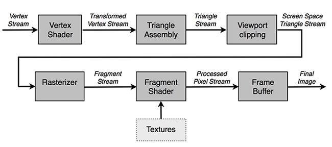

# Vertex and Fragment Shaders

In this article you'll get an introduction to _shaders_. Shaders are the heart
of the Stage3D rendering pipeline. You'll learn what Vertex and Fragment Shaders
are, how they fit in the 3D rendering pipeline, and why they are needed.

### Working with shaders

In the [previous article](./how-stage3d-works.md) in this series on how Stage3D
works, you learned how Stage3D is based on the programmable graphics pipeline.

The programmable graphics pipeline for Stage3D is extremely helpful because you
can program the rendering behavior. This is a vast improvement over the older
fixed function graphics pipeline, which involves simply feeding data into the
GPU so that it could be rendered without any control.

However, it also means that in order to use Stage3D, you are responsible for
writing those programmable bits of code that actually make the pipeline
programmable.

The programmable code in the graphics pipeline are programs called shaders.
Shaders come in two flavors: Vertex Shaders and Fragment Shaders (also called
Pixel Shaders). To render anything at all using Stage3D you'll need to write at
least one Vertex Shader and one Fragment Shader, otherwise your graphics
pipeline is unprogrammed, and it won't work.

Shaders are small programs that run on your graphics hardware GPU, rather than
being executed by the CPU as occurs with normal Haxe code. This is the most
important difference between a shader program and regular code.

Shaders are just GPU programs.

Within Stage3D, shaders are wrapped by a special Stage3D API class called
Program3D. Program3D provides the functionality required to create an instance
of a shader and upload it to the GPU. The shader program can then be executed,
and the Stage3D API allows communication between your main Haxe code and the
shader program.

Shaders are fast. Not to say that Haxe is a slow language, mind you. It also
depends, in part, on which platform you are targeting. For instance, if you
compile Haxe to JavaScript, you're executing code within a virtual machine or
interpreter, and that will be slower than native compiled languages like C++.
That's why many AAA games today are still often written in C++. On the other
hand, if you compile a native app with Haxe, you are actually compiling Haxe to
C++. You get many of the same speed benefits as writing C++ directly, while
enjoying the ergonomics of Haxe. Either way, shaders are independent from
programming languages like Haxe, JavaScript, and C++. Shaders are fast because
they run on the GPU, which is independent from native compiled code, virtual
machines, and interpreters.

OpenFL can create shader programs that are native to the GPU — so they run at
full (GPU) native speed.

### Understanding how shaders fit in the programmable graphics pipeline

The programmable graphics pipeline dictates the way the Stage3D content is
rendered (see Figure 1).



_Figure 1. Programmable graphics pipeline block diagram._

Review the diagram above and notice how Vertex and Fragment Shaders constitute
strategic blocks in the pipeline.

When you are rendering a geometry, you'll have a stream of vertices, called a
VertexBuffer, that define the geometry triangles. This Vertex Stream from the
Vertex Buffer is fed as an input to the Vertex Shader, which can process the
vertices data in a programmable way. The Vertex Shader output is used by the GPU
to assemble triangles. The triangles are then properly clipped and culled to the
Viewport, and then sent to the Rasterizer block, that generates a new output
stream, constituted by something called Fragments: tiny data structures, each of
which is relative to a single triangle pixel that appears on the screen.

The data content of fragments are mostly determined by the Vertex Shader. In
fact, the Vertex Shader has the capability to pass Vertex Attribute parameters
as its output. What the Rasterizer does is to interpolate this per-vertex data
that the Vertex Shader outputs and interpolates it across the triangle, so that
each Fragment (triangle pixel) on the screen gets the proper value for that
specific pixel.

For example, imagine that your Vertex Buffer specifies vertex color as a Vertex
Attribute, and your triangle has two vertices that are specified as being white
and one vertex specified as black. The Vertex Shader will pass these per-vertex
colors to its output, to the following blocks in the pipeline. Then, a Fragment
relative to somewhere in the middle of the triangle will receive a color that is
some shade of gray: an interpolation of the white vertices and black vertex
colors. This gray will be lighter for fragments that are closer to the white
vertices and darker for those fragments that are closer to the black vertex.

These interpolated unprocessed fragments are then sent as input to the Fragment
Shader, which uses the data to establish the final pixel color.

In addition to these fragments that it receives as input, you can also use Haxe
code to send the Fragment Shader one or more input Textures, which the Fragment
Shader can sample.

### Working with Vertex Shaders

Vertex Shaders are little programs that get run on the GPU. As their name
implies, they handle vertices by processing them. A Vertex Shader is a tiny
program that processes vertices.

Generally speaking, you'll create a VertexBuffer with your geometry information
and pass it on to the GPU. Then you'll write a Vertex Shader in a shading
language, like AGAL. The Vertex Shader program is called for every single vertex
in your VertexBuffer.

It's as though there is a for loop around your Vertex program doing something
like this:

```haxe
for (i in 0...vertexBuffer.length)
{
    executeVertexShader(vertexBuffer[i]);
}
```

even though you don't get to see the for loop. So, all vertices in the
VertexBuffer are processed.

You can also pass constant values from Haxe to the Vertex Shader in the form of
constant registers. Every time you want to run the shader (every time you call
the `drawTriangles` method on the Context3D class, to render a mesh), you can
pass in a different value. The shader can use that constant value to modulate
its algorithm and its output.

The input of a Vertex Shader is a VertexBuffer that is constituted by one or
more Vertex Attribute streams. At the very bare minimum, a Vertex Buffer must
contain vertex positions. These vertex positions are usually referred to a
coordinate system that is local to each 3D model (each model has its own
origin). The Vertex Shader transforms the positions to screen space so that they
can properly be displayed. The Vertex Buffer may also contain additional Vertex
Attributes, such as vertex color, or Texture UV coordinates. The Vertex Shader
will usually pass these as output (eventually, after processing them), so that
they can get interpolated by the Rasterizer and passed in to the Fragment Shader
as inputs.

The most obvious and natural use of Vertex Shaders is to perform the matrix
transforms of geometries in the scene. You get all vertices in local space. And
you pass in the transform matrix to the Vertex Shader. The Vertex Shader will
transform all vertices in the VertexBuffer using the matrix. And it performs
this task extremely quickly. Much faster than if you wrote the code in Haxe,
because it's hardware accelerated.

It's interesting to note that Vertex Shaders are completely programmable. You
can modify your geometry in any way you prefer. For example, a typical
application that modifies vertex position is bones: you can define a set of
bones, a skeleton for your geometry, and a skin (a mesh). When the bones rotate,
they are in a hierarchy, and they modify the shape of their skin. This is how
you create an animated human figure. The best way to do that is to pass in the
bones rotations (transforms) to a Vertex Shader, and let the Vertex Shader
modify the skin so that it looks properly animated and deformed.

There are many other applications for using Vertex Shaders: emulating the
appearance of soft cloth, or morphing objects. Create two meshes, with same
number of vertices and have the Vertex Shader morph mesh1 into mesh2, depending
on the value of a morph parameter.

### Working with Fragment Shaders

Like Vertex Shaders, Fragment Shaders are also little programs that run on the
GPU. As their name implies, Fragment Shaders deal with fragments—they are
responsible for outputting the final pixel color of each rendered triangle
pixel.

Basically it works like this: Fragment Shader receives as input all those
fragments that have been passed along the pipeline by the Vertex Shader. As
described above, the fragments that reach the Fragment Shader input are the
interpolated version of the Vertex Attributes output by the Vertex Shader.

The Fragment Shader execution flow is essentially like a hidden loop. If you
imagine having your unprocessed fragments into some sort of stream called
fragmentStream, then executing the Fragment Shader will be equivalent to doing
something like this:

```haxe
for (i in 0...fragmentStream.length)
{
    executeFragmentShader(fragmentStream[i]);
}
```

The input fragmentStream is, so to speak, unprocessed. This means that the
Fragment Shader can process it, and calculate the final color for that triangle
screen pixel.

Fragment Shaders are really at the core of the programmable graphics pipeline.
The most common use for Fragment Shaders is to calculate the various triangles
pixel colors starting from either Vertex Attributes color, for vertex-colored
geometries, or from Texture and related Vertex Attribute UV Texture coordinates,
for textured geometries.

But Fragment Shaders are not limited to creating these simple effects. Actually
a Fragment Shader is used to create all those amazing 3D effects that you see in
modern 3D games. For example, dynamic lighting effects are mostly accomplished
using Fragment Shaders. If you think of it, dynamic lighting just means
calculating pixel colors according to the existing lights in the scene, how they
are positioned with respect to our geometry, and the geometry's material. That's
why dynamic lighting is mostly created with Fragment Shaders.

Reflection effects, such as water or environmental mapping, are all made with
Fragment Shaders. The world of effects that can be generated with Fragment
Shaders is extremely vast, and these basic effects are only the tip of the
iceberg compared to what is possible.

In the end, what you see on the screen is decided by the Fragment Shader. So,
Fragment Shaders are the code that manages the content that is actually
rendered.

### Where to go from here

In this tutorial, you've learned the concepts of working with Vertex and
Fragment Shaders. These shaders constitute the heart of the rendering pipeline
in the Stage3D API. Shaders can be used to create all types of 3D graphics
effects, and there is quite a bit of literature online that covers shader-based
techniques. Continue on to the next tutorial in this Stage3D series to learn
about shading languages, and specifically take a look at AGAL (Adobe Graphics
Assembly Language).

- [3. What is AGAL?](./what-is-agal.md)
- [4. Hello Triangle](./hello-triangle.md)
- [5. Working with Stage3D and perspective projection](./working-with-stage3d-and-perspective-projection.md)
- [6. Working with 3D cameras](./working-with-3d-cameras.md)
- [7. Mipmapping for smoother textures in Stage3D](./mipmapping-for-smoother-textures-in-stage3d.md)

To research shaders in more detail, check out the famous 'GPU Gems' books by
nVidia, which have been released online for free. They are not specific to
working with OpenFL and Stage3D but they provide a helpful overview of effects
you can create using shaders:

- [GPU Gems: Part I - Natural Effects](https://developer.nvidia.com/gpugems/gpugems/part-i-natural-effects)
- [GPU Gems 2: Part I - Geometric Complexity](https://developer.nvidia.com/gpugems/gpugems2/part-i-geometric-complexity)
- [GPU Gems 3](https://developer.nvidia.com/gpugems/gpugems3)
