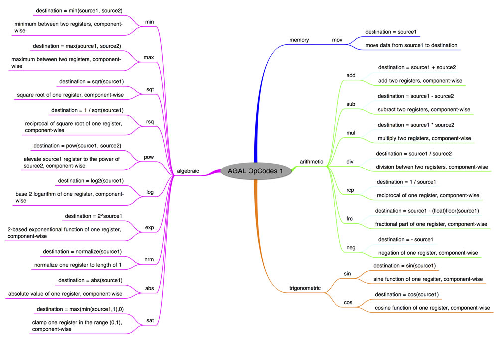
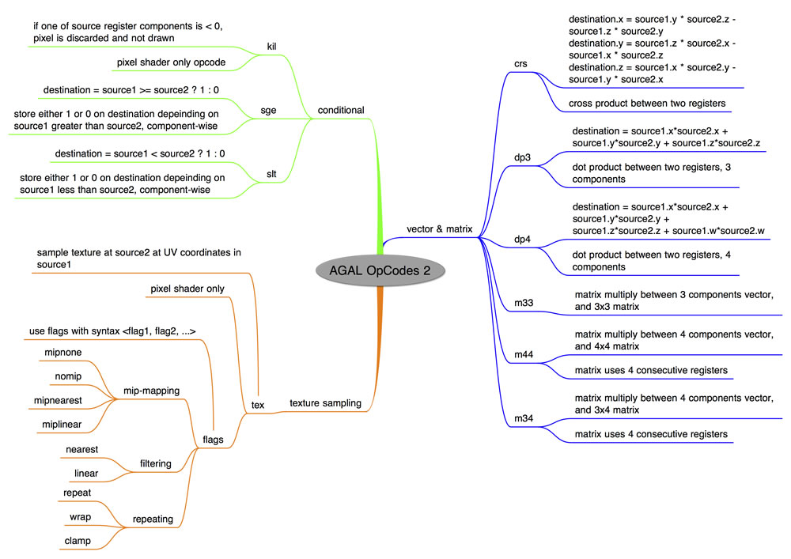

# What is AGAL?

In this article you'll get an introduction to working with shading languages.
I'll cover the basics of using the low level shading language, called AGAL
(Adobe Graphics Assembly Language) that is included with the Stage3D API. You'll
learn what AGAL is, how it works, and how to use it as part of your
Stage3D-based OpenFL application.

### Understanding Shading languages

Before diving into AGAL specifically, it's a good idea to first understand what
a shading language is and how you can use it to create shaders.

Shaders are not written in Haxe. They are not written in C++ either. Nor any
other general purpose language.

Shaders are usually written in a special language, called a shading language.

Shaders are programs that run on the GPU, so the most efficient way to code a
shader is to use a language that is specifically engineered with the GPU in
mind. That's why you'll write shaders using these special shading languages,
instead of using general purpose languages designed to code for a CPU.

There are several shading languages that have been used over the years, for the
two standard native 3D platforms (OpenGL and DirectX): GLSL and HLSL are two of
the most common shading languages.

The Stage3D API provides AGAL as a shading languages to create programs for the
GPU.

### Overview of AGAL

AGAL (Adobe Graphics Assembly Language) is an assembly language for GPU
programming. It's a very low level language, that is extremely close to what the
GPU actually executes. A GPU (and also a CPU for that matter) doesn't directly
understand a high level kind of language like Haxe, which contains variables,
classes, and so on. GPUs only understand elementary machine language commands.
There is a compiler somewhere in the pipeline that translates the complex
commands of the high level language, into a series of simpler, lower level
machine language commands.

With AGAL, you write commands directly at the lower level, similar to the
commands that the GPU understands. As a result, you get a better understanding
of what's really happening in your rendering pipeline. You can hand optimize
your shader instead of letting a compiler do that for you. So, as you invest
more time to learn AGAL, you may be able to create better optimized shaders.

When you use AGAL, your shaders come in the form of shader program strings, that
are assembled into object code at run time. So, it is possible to create AGAL
shaders dynamically at runtime.

### Examining the syntax of AGAL

AGAL is an assembly language. If you are used to the code syntax in Haxe, a
language like AGAL that is an assembly might look a bit alien at first.

Here's an example of an AGAL Vertex Shader:

```
m44 op, va0, vc0
mov v0, va1
```

I'll describe the syntax of the example above, so that you can decipher what
each of those assembly lines means.

Every line of the shader is a command, specified by a 3 character string called
opcode.

The syntax of an AGAL code line is comprised of the following:

```
<opcode> <destination>, <source 1>, <source 2 or sampler>
```

This is the key. Keep this syntax in mind and AGAL will suddenly stop looking
like unreadable gibberish.

Following the opcode, depending on the command, there may also be a destination,
and one or two sources. The destination and the sources are called registers:
small memory areas in the GPU for use by shaders. I'll cover registers in more
detail later in this tutorial. The sources contain the values used in the
operation, and the destination is where the result is stored.

### Identifying the main opcodes in AGAL

AGAL features approximately 40 different opcodes. Here are some of the most
common ones.

- `mov:` moves data from source1 to destination, component-wise
- `add:` destination = source1 + source2, component-wise
- `sub:` destination = source1 – source2, component-wise
- `mul:` destination = source1 \* source2, component-wise
- `div:` destination = source1 / source2, component-wise
- `dp3:` dot product (3 components) between source1 and source2
- `dp4:` dot product (4 components) between source1 and source2
- `m44:` multiplication between 4 components vector in source1 and 4×4 matrix in
  source2
- `tex:` texture sample. Load from texture at source2 at coordinates source1.

Figure 1 and Figure 2 provide an overview of the AGAL command set.



_Figure 1. AGAL Memory, Arithmetic, Trigonometric and Algebraic related
opcodes._



_Figure 2. AGAL Vector and Matrix, Conditional, and Texture Sampling Related
opcodes._

### Working with AGAL registers

AGAL doesn't use variables to store data, like Haxe and other high level
languages do. AGAL just uses registers.

Registers are small memory areas in the GPU that AGAL programs (shaders) can use
during their execution. Registers are used to store both the sources and the
destination of AGAL commands.

You can also pass parameters to your shaders through these registers.

Each register is 128 bits wide, which means that it contains 4 floating point
values. Each of these values is called a component of the register.

Register components can be accessed both through the coordinate accessors
(xyzw), and through the color accessors (rgba).

The first component of a register, can be accessed like this:

```
<register name>.x
```

As well as with this code:

```
<register name>.r
```

Sometimes registers contain coordinate-like data, while other times they contain
color data. By using the right kind of accessors, you can make your code clearer
and easier to read.

Some of the opcodes above, like `add`, perform their operations component wise.
This means that the addition operation is performed component by component, so
that the x component is added to the x component, the y component is added to
the y component, and so on.

There are six types of registers available.

#### 1. Attribute registers

These registers reference the Vertex Attribute data of the VertexBuffer that is
the input of the Vertex Shader. Therefore, they are only available in Vertex
Shaders.

This is the main data stream that the Vertex Shader is responsible for
processing. Each vertex attribute in the VertexBuffer has its own attribute
register.

In order to assign a VertexBuffer attribute to a specific attribute register,
use the function `setVertexBufferAt()` on a `Context3D` instance, with the
proper index.

Then from the shader, access the attribute register with the syntax: `va<n>`,
where `<n>` is the index number of the attribute register.

There are a total of eight attribute registers available to Vertex Shaders.

#### 2. Constant registers

These registers serve the purpose of passing parameters from Haxe to the
shaders. This is performed with the `setProgramConstants()` family of functions
on the `Context3D` class.

These registers are accessed from the shader with the syntax: `vc<n>` for Vertex
Shaders and `fc<n>` for Fragment Shaders, where `<n>` is the index number of the
constant register.

There are 128 constant registers available to Vertex Shaders, and 28 constant
registers for Fragment Shaders.

#### 3. Temporary registers

These registers are available to shaders, and they are used for temporary
calculations. Since AGAL doesn't use variables, you'll use temporary registers
to store data throughout your code.

Temporary registers are accessed with the syntax `vt<n>` (Vertex Shaders) and
`ft<n>` (Fragment Shaders) where `<n>` is the register number.

There are 8 temporary registers available for Vertex Shaders, and 8 for Fragment
Shaders.

#### 4. Output registers

The output registers are used by Vertex and Fragment Shaders to store the output
of their calculations. For Vertex Shaders, this output is the position of the
vertex. For Fragment Shaders it is the color of the pixel.

These registers are accessed with the syntax `op` for Vertex Shaders, and `oc`
for Fragment Shaders.

There is obviously only one output register for Vertex and for Fragment Shaders.

#### 5. Varying Registers

These registers are used to pass data from Vertex Shaders to Fragment Shaders.
The data that is passed is properly interpolated by the GPU, so that the
Fragment Shader receives the correct value for the pixel that is being
processed.

Typical data that gets passed in this way is the vertex color or the UV
coordinates for texturing.

These registers can be accessed with the syntax `v<n>`, where `<n>` is the
register number.

There are 8 varying registers available.

#### 6. Texture sampler registers

Texture Sampler registers are used to pick color values from textures, based on
UV coordinates.

The texture to be used is specified through Haxe with the call `setTextureAt()`
on a `Context3D` instance.

The syntax for using texture samplers is: `fs<n> <flags>`, where `<n>` is the
sampler index, and `<flags>` is a set of one or more flags that specifies how
the sampling should be made.

`<flags>` is a comma separated set of strings, that defines:

- texture dimension. Options: `2d`, `cube`
- mip mapping. Options: `nomip` (or `mipnone`, they are the same), `mipnearest`,
  `miplinear`
- texture filtering. Options: `nearest`, `linear`
- texture repeat. Options: `repeat`, `wrap`, `clamp`

For example, a standard 2D texture without MIP mapping and linear filtering
could be sampled into temporary register `ft1`, with the following line:

```
tex ft1, v0, fs0 <2d,linear,nomip>
```

In the example above, the varying register `v0` holds the interpolated texture
UVs.

### Creating a sample AGAL shader

In this section, you'll go through a shader example and get a better
understanding of how it operates.

Suppose the vertices in the Vertex Buffer contain vertex position, at offset 0,
and vertex color, at offset 3. The code looks like this:

```haxe
var vertices:Vector<Float> = Vector.ofValues(
    -0.3,-0.3, 0.0, 1.0, 0.0, 0.0, // x, y, z, r, g, b
    -0.3, 0.3, 0.0, 0.0, 1.0, 0.0,
     0.3, 0.3, 0.0, 0.0, 0.0, 1.0);
```

The goal is to make the Vertex Shader properly transform the vertex positions,
and to pass on each vertex color to the Fragment Shader.

You can achieve this with the following code:

```
m44 op, va0, vc0 // pos to clipspace
mov v0, va1 // copy color
```

The first line performs a 4×4 matrix multiplication between the vertex input
attribute register 0, va0, and a transformation matrix that is being passed in
from Haxe. When rendering in perspective, this is usually the transformation
matrix from model space to clip space that we assume was passed from Haxe to the
constant register 0, `vc0`.

Note: Clip space and perspective projection is discussed in more detail in the
next tutorial in this series, titled
[Working with Stage3D and perspective projection](./working-with-stage3d-and-perspective-projection.md).

The matrix can be passed to the shader, into register `vc0` with the call:

```haxe
context3D.setProgramConstantsFromMatrix(Context3DProgramType.VERTEX, 0, matrix, true);
```

The second line of the Vertex Shader, copies the vertex color data to Varying
Register 0, `v0`, so that it can get interpolated by the GPU, and passed to the
Fragment Shader.

The Fragment Shader simply copies the Varying Register `v0` color content to its
Output Register oc:

```
mov oc, v0
```

So, this Vertex/Fragment Shader pair just transforms the 3D model vertices using
a transform matrix that gets passed in from Haxe, and applies vertex color.

This is it! Your first Vertex and Fragment Shaders.

### Building a sample OpenFL app with Program3D and AGAL Mini Assembler

So, how do you actually fit those bits of AGAL code into a working OpenFL
application? This is where the Stage3D API comes in.

```haxe
var program:Program3D = context3D.createProgram();
```

Before being able to use a `Program3D` (a shader) for rendering, you first need
to upload it to the GPU. You do that by calling the `upload` method on the
`Program3D` class.

````haxe
public function upload(vertexByteCode:ByteArray, fragmentByteCode:ByteArray):Void;
```

This method call needs as input the compiled, object code, version of the Vertex
and Fragment Shaders in order to upload it to the GPU.

A good way to compile AGAL shaders into object code is to use the `openfl.utils.AGALMiniAssember` class: a utility tool that takes as input the Vertex and Fragment Shaders
source code as strings, and compiles them at runtime into object code.

So, first you are going to use AGAL Mini Assembler to compile the Vertex and
Fragment Shaders discussed above.

```haxe
var vertexShaderAssembler:AGALMiniAssembler = new AGALMiniAssembler();
vertexShaderAssembler.assemble(Context3DProgramType.VERTEX,
    "m44 op, va0, vc0\n" + // pos to clipspace
    "mov v0, va1" // copy color
);
var fragmentShaderAssembler:AGALMiniAssembler= new AGALMiniAssembler();
fragmentShaderAssembler.assemble(Context3DProgramType.FRAGMENT,
    "mov oc, v0"
);
````

And then upload both Vertex and Fragment Shader programs to the GPU:

```haxe
var program:Program3D = context3D.createProgram();
program.upload(vertexShaderAssembler.agalcode, fragmentShaderAssembler.agalcode);
```

### Communicating to AGAL with Haxe

A shader doesn't live just by itself. It is used by your main Stage3D based
OpenFL application. Therefore it needs the application to send to it the data
that needs to processed.

In general, shaders will need VertexBuffer data (Vertex Attributes), Textures,
and additional parameters that the shader may need from Haxe, such as a
transform matrix.

At render time, before using a `Program3D`, and related VertexBuffers and
Textures, you'll need to enable them, by using the following calls:

- `Contex3D::setProgram(program:Program3D)`
- `Context3D::setVertexBufferAt(index:Int, buffer:VertexBuffer3D, bufferOffset:Int, format:String)`
- `Context3D::setTextureAt(sampler:Int, texture:TextureBase)`

Note that `setVertexBufferAt` enables a specific Vertex Attribute at a certain
offset in the Vertex Buffer (parameter 3), and associates it to an Attribute
Register (stream) specified by index (first parameter).

The `setTextureAt` call enables a `Texture` and associates it with a certain
Texture Sampler specified by the first parameter `sampler`.

This would be the syntax to use these calls, right before rendering:

```haxe
// vertex position to attribute register 0
context3D.setVertexBufferAt(0, vertexBuffer, 0, Context3DVertexBufferFormat.FLOAT_3);
// assign texture to texture sampler 0
context3D.setTextureAt(0, texture);
// assign shader program
context3D.setProgram(program);
```

Before enabling any of these you need to make sure that they are uploaded to the
GPU, by calling the respective upload methods:

- `Program3D::upload()`
- `VertexBuffer3D::uploadFromVector(data:Vector<Float>, startVertex:Int, numVertices:Int)`
- `Texture::uploadFromBitmapData(source:BitmapData, miplevel:UInt = 0)`

Then you'll want to be able to pass in parameters to your shaders as constants,
stored into Constant Registers. You do that with the following calls:

- `Context3D::setProgramConstantsFromVector(programType:String, firstRegister:Int, data:Vector<Float>, numRegisters:Int = -1)`
- `Context3D::setProgramConstantsFromMatrix(programType:String, firstRegister:Int, matrix:Matrix3D, transposedMatrix:Bool = false)`

in order to write an OpenFL `Vector` or a `Matrix3D` respectively.

So, if you need to pass in a basic rotation matrix to your shader you'll do
something like this:

```haxe
var m:Matrix3D = new Matrix3D();
m.appendRotation(Lib.getTimer() / 50.0, Vector3D.Z_AXIS);
context3D.setProgramConstantsFromMatrix(Context3DProgramType.VERTEX, 0, m, true);
```

The matrix gets stored into Constant Register 0 here, for the Vertex Shader to
use.

### Where to go from here

This article introduced you to the concept of shaders and to the AGAL shading
language. Creating a shader is a required step if you want to build an OpenFL 3D
application that is based on the Stage3D API. While we didn't get to build a
fully working Stage3D application yet, the content of this article is a
fundamental block in being able to use the Stage3D API. In the next article of
this series I am going to put everything together, and show you how to build an
application that uses Stage3D to render a simple geometry.

- [4. Hello Triangle](./hello-triangle.md)
- [5. Working with Stage3D and perspective projection](./working-with-stage3d-and-perspective-projection.md)
- [6. Working with 3D cameras](./working-with-3d-cameras.md)
- [7. Mipmapping for smoother textures in Stage3D](./mipmapping-for-smoother-textures-in-stage3d.md)
