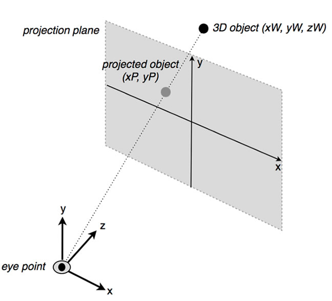
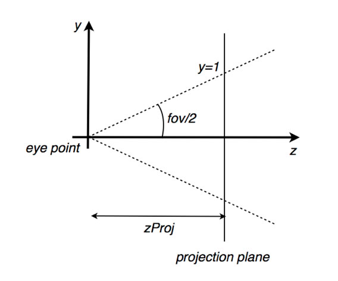

# Working with Stage3D and perspective projection

In this tutorial, you'll learn about the concept of perspective. Perspective is
a fundamental topic when developing OpenFL projects that use 3D rendering.
You'll explore how to work with the Stage3D API to render a 3D world in
perspective using Stage3D. This tutorial is a part of a series on working with
Stage3D and builds upon the information provided in the previous tutorials
describing how to render a triangle. You'll take that sample project to the next
level by rendering the 3D scene with perspective.

### Understanding perspective

In the real world, we see things in a way that is called "perspective".

Perspective refers to the concept that objects that are farther away appear to
be smaller than those that are closer to you. Perspective also means that if you
are sitting in the middle of a straight road, you actually see the borders of
the road as two converging lines.

That's perspective. Perspective is critical in 3D projects. Without perspective,
the 3D world doesn't look real.

While this may seem natural and obvious, it's important to consider that when
you create a 3D rendering on a computer you are attempting to simulate a 3D
world on the computer screen, which is a 2D surface.

Imagine that behind the computer screen there is a real 3D scene of sorts, and
you are watching it through the "glass" of your computer screen. Using
perspective, your goal is to create code that renders what gets "projected" on
this "glass" of your screen as if there was this real 3D world behind the
screen. The only caveat is that this 3D world is not real…it's just a
mathematical simulation of a 3D world.

So, when using 3D rendering to simulate a scene in 3D and then projecting the 3D
scene onto the 2D surface of your screen, the process is called perspective
projection.

Begin by envisioning intuitively what you want to achieve. If an object is
closer to the viewer, the object must appear to be bigger. If the object is
farther away, it must appear to be smaller. Also, if an object is traveling away
from the viewer, in a straight line, you want it to converge towards the center
of the screen, as it moves farther off into the distance.

### Translating perspective into math

As you view the illustration in Figure 1, imagine that an object is positioned
in your 3D scene. In the 3D world, the position of the object can be described
as xW, yW, zW, referring to a 3D coordinate system with the origin in the
eye-point. That's where the object is actually positioned, in the 3D scene
beyond the screen.



Figure 1. The perspective projection of a 3D object.

As the viewer watches this object on the screen, the 3D object is "projected" to
a 2D position described as xP and yP, which references the 2D coordinate system
of the screen (projection plane).

To put these values into a mathematical formula, I'll use a 3D coordinate system
for world coordinates, where the x axis points to the right, y points up, and
positive z points inside the screen. The 3D origin refers to the location of the
viewer's eye. So, the glass of the screen is on a plane orthogonal (at right
angles) to the z-axis, at some z that I'll call zProj.

You can calculate the projected positions xP and yP, by dividing the world
positions xW, and yW, by zW, like this:

```
xP = K1 * xW  / zW
yP = K2 * yW / zW
```

K1 and K2 are constants that are derived from geometrical factors such as the
aspect ratio of your projection plane (your viewport) and the "field of view" of
your eye, which takes into account the degree of wide-angle vision.

You can see how this transform simulates perspective. Points near the sides of
the screen get pushed toward the center as the distance from the eye (zW)
increases. At the same time, points closer to the center (0,0) are much less
affected by the distance from the eye and remain close to the center.

This division by z is the famous "perspective divide."

Now, consider that an object in the 3D scene is defined as a series of vertices.
So, by applying this kind of transform to all vertices of geometry, you
effectively ensure that the object will shrink when it's farther away from the
eye point.

In the next section, you'll use this perspective projection formula into Haxe
that you can use in your OpenFL 3D projects.

### Translating perspective math into code

When converting the perspective divide from a math statement into code, you'll
use matrices.

When you first start, the process of working with perspective projection and
matrices is tricky. A matrix transform is a linear transform: the transformed
vector components are simply linear combinations of the input vector. Linear
transforms only support translations, rotations, scaling, and skewing. But they
don't allow operations like the perspective divide, where a component is divided
by another component.

Now, remember that three-dimensional coordinates are usually represented with
four-dimensional vectors of the form (x, y, z, w), where w is usually 1. The
solution to the matrix-based perspective divide issue is to use the fourth
coordinate w in a creative way, by storing the zW coordinate into the w
coordinate of the transformed vector.

The other components of the transformed vector are the pre-multiplied version of
xP and yP by zW.

You'll use the following transform:

```
xW -> xP' = xP * zW = K1 * xW
yW -> yP' = yP * zW = K2 * yW
```

On first sight, since you are projecting to the screen that is 2D, it might seem
enough to just calculate the projected coordinates for xP and yP. However the
rendering pipeline cannot completely lose track of the depth (z) coordinate
because it needs to depth-sort the different pixels that are rendered. The
standard process involves calculating a "projected" zP (zP') that equals zero
for values of zW that are at a distance zW equal to zNear, which we define as
"near clipping distance." Near clipping distance is simply the closest distance
we wish to render. I'll discuss clipping in more detail later in this tutorial,
but here is the formula to calculate this transformed zP' to be used for
clipping:

```
zW -> zP' = K3 * (zW - zNear)
```

The entire transformation is definitely possible to achieve with a linear matrix
transform, as the transformed vectors are a linear combination of the world
vector to transform.

Next, the actual transformed xP and yP values are obtained by dividing the
transformed x, y, z, components by w, like this:

```
xP = K1 * xW
yP = K2 * yW
zP = K3 * (zW - zNear) / zW
```

The calculations shown above are exactly what you need to set up the next part.

#### Working with clip space and Normalized Device Coordinates

Stage3D expects you to use a matrix in your Vertex Shader that transforms
vertices to a special space:

```
(x, y, z, w) = (xP', yP', zP', zW)
```

With xP', yP', zP' and zW defined as above, and where constants K1, K2 and K3
are chosen so that xP and yP of all visible points in the 3D world are in the
range (-1, 1), and zP falls in the range (0, 1).

This means that an object falling at the right edge of the screen, once
projected, will have xP = 1, and one at the left edge will have xP = -1.

This 4-dimensional space (xP', yP', zP', zW) is called clip space, as it's the
area where clipping usually takes place. The (xP, yP, zP) coordinates, after the
divide, with range (-1,1) (for xP and yP), and range (0, 1) (for zP) are called
Normalized Device Coordinates (NDC).

Stage3D and the GPU use the data from the output of your shader in clip space
form to carry on internally with the perspective divide.

#### A note on clipping

Objects that sit on the "closest distance we want to render", at zW = zNear, get
a zP equal to 0. While those that are at some distance that is defined as zW =
zFar are transformed in NDC space to zP = 1.

zNear and zFar define the clipping planes. Objects falling closer than zNear
will be clipped (not drawn), just like objects falling farther away than zFar.
Also, objects with xP and yP outside the range (-1, 1) will be clipped.

For simplicity, I'm working with point objects here. An actual extended object
can get partially clipped, as parts of it fall into view, while other parts fall
outside it.

### Using PerspectiveMatrix3D

The correct values for K1, K2 and K3 to use to get the NDC ranges for xP, yP, zP
mentioned above are:

```
K1 = zProj / aspect
K2 = zProj
K3 = zFar / (zFar – zNear)
```

In this example, aspect is the viewport aspect ratio.

It's easy to verify that these values, for those world points (xW, yW, zW) that
fall on the projection plane (i.e. zW = zProj), the NDC ranges
`xP = (-1, 1), yP = (-1, 1)` and `zP = (0, 1) `correspond to world ranges equal
to `xW = (-aspect, aspect) and yW = (-1, 1)`. World points at different
distances zW will scale accordingly with the perspective projection equation.
Similarly, the zP range of (0, 1) corresponds to the world range
`zW = (zNear, zFar)`.

It is usually more convenient to specify these constants in terms of fov (field
of view) angle (the angle that defines the eye's degree of wide-angle vision),
instead of using the zProj distance. Figure 2 illustrates both `fov` and zProj
defined in a side view of the projection reference system.



Figure 2. A side view of the projection reference system.

Using this strategy for calculating the value of zProj:

```
zProj = 1 / tg (fov/2)
```

The scaling constants become:

```
K1 = 1 / (aspect*tg(fov/2))
K2 = 1 / tg(fov/2)
K3 = zFar / (zFar – zNear)
```

You can use `openfl.utils.PerspectiveMatrix3D`, a simple extension of the
Matrix3D class to help with this process. It implements a few simple functions
that create the perspective matrix transform needed for this project, with the
correct values for the constants K1, K2 and K3:

- `PerspectiveMatrix3D::perspectiveFieldOfViewLH`
- `PerspectiveMatrix3D::perspectiveFieldOfViewRH`

Throughout this tutorial, I've been using a world coordinate system where x
points to the right, y points up, and positive z enters the screen, which is a
[left handed coordinate system](https://en.wikipedia.org/wiki/Cartesian_coordinate_system).
Therefore I'll use the LH flavor of the matrix function.

Using PerspectiveMatrix3D, the process of creating a perspective matrix that's
suitable for Stage3D is very simple because it just requires you to define a few
parameters. For example you could use the code below to set the values of the
required variables:

```haxe
var aspect:Float = 4/3;
var zNear:Float = 0.1;
var zFar:NumFloatber = 1000;
var fov:Float = 45*Math.PI/180;
var projectionTransform:PerspectiveMatrix3D = new PerspectiveMatrix3D();
projectionTransform.perspectiveFieldOfViewLH(fov, aspect, zNear, zFar);
```

As described above, zNear and zFar are the near and far clipping planes
respectively; aspect is the aspect ratio and fov is the field of view angle.

### Building a perspective projection sample application

In this section you'll use this matrix to create a simple update to the sample
application I had provided in my previous Developer Center tutorial titled:
Hello Triangle. If you haven't already completed the tutorials in the series
prior to this one, please follow along with the instructions in that tutorial to
learn how to build the basis of the sample project you'll extend in the steps
below.

In this example, instead of working with a triangle, you'll render a rectangle
so that it's easier to notice the effect of perspective.

Begin by appending (pre-multiplying) the projection matrix to the queue of
matrix transforms that are used to position and rotate the object. The code
below also adds a different spin to the rotations, so that the perspective is
visible.

```haxe
var m:Matrix3D = new Matrix3D();
m.appendRotation(Lib.getTimer() / 30.0, Vector3D.Y_AXIS);
m.appendRotation(Lib.getTimer() / 10.0, Vector3D.X_AXIS);
m.appendTranslation(0, 0, 2);
m.append(projectionTransform);
```

Here is the entire code sample used in the perspective projection demo
application:

```haxe
import openfl.Assets;
import openfl.Lib;
import openfl.Vector;
import openfl.display.BitmapData;
import openfl.display.Sprite;
import openfl.display.StageAlign;
import openfl.display.StageScaleMode;
import openfl.display3D.Context3D;
import openfl.display3D.Context3DProgramType;
import openfl.display3D.Context3DTextureFormat;
import openfl.display3D.Context3DVertexBufferFormat;
import openfl.display3D.IndexBuffer3D;
import openfl.display3D.Program3D;
import openfl.display3D.VertexBuffer3D;
import openfl.display3D.textures.Texture;
import openfl.events.Event;
import openfl.geom.Matrix3D;
import openfl.geom.Vector3D;
import openfl.utils.AGALMiniAssembler;
import openfl.utils.PerspectiveMatrix3D;

class PerspectiveSample extends Sprite
{
    private var context3D:Context3D;
    private var vertexbuffer:VertexBuffer3D;
    private var indexBuffer:IndexBuffer3D;
    private var program:Program3D;
    private var texture:Texture;
    private var projectionTransform:PerspectiveMatrix3D;

    public function new()
    {
        super();

        stage.stage3Ds[0].addEventListener(Event.CONTEXT3D_CREATE, initStage3D);
        stage.stage3Ds[0].requestContext3D();

        stage.scaleMode = StageScaleMode.NO_SCALE;
        stage.align = StageAlign.TOP_LEFT;

        addEventListener(Event.ENTER_FRAME, onRender);
    }

    private function initStage3D(e:Event):Void
    {
        context3D = stage.stage3Ds[0].context3D;
        context3D.configureBackBuffer(800, 600, 1, true);

        var vertices:Vector<Float> = Vector.ofValues(
            -0.3,-0.3, 0.0, 0.0, 0.0, // x, y, z, u, v
            -0.3, 0.3, 0.0, 0.0, 1.0,
             0.3, 0.3, 0.0, 1.0, 1.0,
             0.3,-0.3, 0.0, 1.0, 0.0);

        // 4 vertices, of 5 Floats each
        vertexbuffer = context3D.createVertexBuffer(4, 5);
        // offset 0, 4 vertices
        vertexbuffer.uploadFromVector(vertices, 0, 4);

        // total of 6 indices. 2 triangles by 3 vertices each
        indexBuffer = context3D.createIndexBuffer(6);

        // offset 0, count 6
        indexBuffer.uploadFromVector(Vector.ofValues(0, 1, 2, 2, 3, 0), 0, 6);

        var bitmapData:BitmapData = Assets.getBitmapData("assets/img/RockSmooth.jpg");
        texture = context3D.createTexture(bitmapData.width, bitmapData.height, Context3DTextureFormat.BGRA, false);
        texture.uploadFromBitmapData(bitmapData);

        var vertexShaderAssembler:AGALMiniAssembler = new AGALMiniAssembler();
        vertexShaderAssembler.assemble(Context3DProgramType.VERTEX,
            "m44 op, va0, vc0\n" + // pos to clipspace
            "mov v0, va1" // copy uv
        );
        var fragmentShaderAssembler:AGALMiniAssembler= new AGALMiniAssembler();
        fragmentShaderAssembler.assemble(Context3DProgramType.FRAGMENT,
            "tex ft1, v0, fs0 <2d,linear,nomip>\n" +
            "mov oc, ft1"
        );

        program = context3D.createProgram();
        program.upload(vertexShaderAssembler.agalcode, fragmentShaderAssembler.agalcode);

        projectionTransform = new PerspectiveMatrix3D();
        var aspect:Float = 4/3;
        var zNear:Float = 0.1;
        var zFar:Float = 1000;
        var fov:Float = 45*Math.PI/180;
        projectionTransform.perspectiveFieldOfViewLH(fov, aspect, zNear, zFar);
    }

    private function onRender(e:Event):Void
    {
        if (context3D == null)
            return;

        context3D.clear(1, 1, 1, 1);

        // vertex position to attribute register 0
        context3D.setVertexBufferAt(0, vertexbuffer, 0, Context3DVertexBufferFormat.FLOAT_3);
        // uv coordinates to attribute register 1
        context3D.setVertexBufferAt(1, vertexbuffer, 3, Context3DVertexBufferFormat.FLOAT_2);
        // assign texture to texture sampler 0
        context3D.setTextureAt(0, texture);
        // assign shader program
        context3D.setProgram(program);

        var m:Matrix3D = new Matrix3D();
        m.appendRotation(Lib.getTimer()/30, Vector3D.Y_AXIS);
        m.appendRotation(Lib.getTimer()/10, Vector3D.X_AXIS);
        m.appendTranslation(0, 0, 2);
        m.append(projectionTransform);

        context3D.setProgramConstantsFromMatrix(Context3DProgramType.VERTEX, 0, m, true);

        context3D.drawTriangles(indexBuffer);

        context3D.present();
    }
}
```

### Where to go from here

In this tutorial, you learned about one of the most important topics of 3d
rendering: perspective projection. Now that you have a better understanding of
what perspective is and how to implement it within Stage3D, proceed to the next
tutorial in the series. In the
[next tutorial in the series](./working-with-3d-cameras.md), you'll learn how to
work with 3D Cameras and see how to implement a point of view that moves around
in the 3D scene. The remaining tutorials in the series include:

- [6. Working with 3D cameras](./working-with-3d-cameras.md)
- [7. Mipmapping for smoother textures in Stage3D](./mipmapping-for-smoother-textures-in-stage3d.md)

For more information on perspective projection and 3D related math, check out a
great book by James M. Van Verth and Lars M. Bishop called
"[Essential Mathematics for Games and Interactive Applications](https://www.amazon.com/Essential-Mathematics-Interactive-Applications-Second/dp/0123742978/)."
